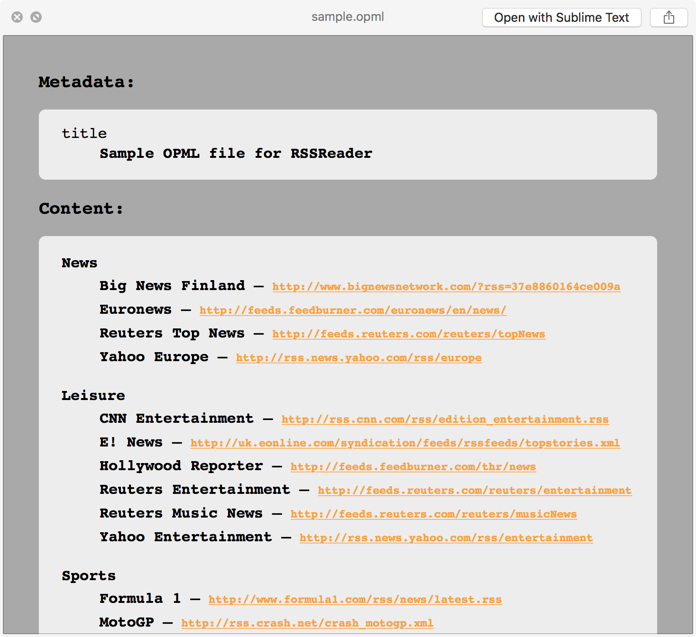

# QLOPML

Quick Look generator for `.opml` files.  
Optimized for RSS reader outline files. E.g., see my other project [baRSS](https://github.com/relikd/baRSS).

## Install

1) Build project or download [lastest release](https://github.com/relikd/QLOPML/releases/latest)
2) Copy `QLOPML.qlgenerator` to either `/Library/QuickLook` (system wide) or `~/Library/QuickLook` (user)
3) Run `qlmanage -r` to update Quick Look cache.

## License

[MIT License](https://opensource.org/licenses/MIT)
